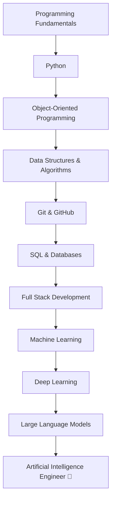

<div align="center">


<h1>Hi 👋, I'm Sharvari Pathade</h1>

<h3>
Aspiring AI Engineer • Python Enthusiast • Problem Solver • Building in Public
</h3>

<p>


</p>

</div>

---

# 👋 About Me

```text
"Every expert was once a beginner.
This GitHub is the story of my beginning."
```

I'm **Sharvari Pathade**, a Computer Engineering student passionate about building a career in **Artificial Intelligence**.

Rather than rushing through technologies, I'm focused on mastering the fundamentals of programming, strengthening my problem-solving skills, and building meaningful projects that solve real-world problems.

I believe that **consistency beats intensity**, and this GitHub profile is where I document that journey—one project, one lesson, and one commit at a time.

My long-term goal is to become an **AI Engineer** capable of building intelligent products that create real impact.

---

# 🚀 Current Mission

```text
🎯 Mission 2026
```

I'm currently focused on:

- 🐍 Mastering Python from fundamentals to advanced concepts
- 🧩 Solving Data Structures & Algorithms consistently
- 🤖 Learning Artificial Intelligence & Machine Learning
- 🌐 Building Full Stack Applications
- ⚡ Creating automation tools that solve real problems
- 🌍 Preparing for Open Source contributions
- 💼 Building a strong portfolio for future opportunities

---

# 🌱 What You'll Find Here

This GitHub isn't just a collection of repositories.

It's a record of my journey toward becoming an AI Engineer.

You'll find:

- 📚 Learning notes
- 🐍 Python projects
- 🧩 DSA practice
- 🤖 AI experiments
- 📱 Flutter applications
- 🌐 Full Stack projects
- ⚡ Automation tools
- 🚀 Open Source contributions (coming soon)

---

# 🛠️ Tech Stack

### 💻 Languages

<p align="center">


</p>

### ⚙️ Frameworks & Technologies

<p align="center">


</p>

### 🧰 Tools I Use

<p align="center">


</p>

---

# 💡 Philosophy

> **Building today for the engineer I want to become tomorrow.**

I don't aim to know everything overnight.

I aim to become **1% better every single day**.

Every repository here represents another step forward.

⭐ Thanks for being part of my journey.

---
# 📊 GitHub Analytics

<p align="center">


</p>

<p align="center">


</p>

---

# 📈 Contribution Activity

<p align="center">


</p>

---

# 🏆 Milestones & Achievements

<p align="center">


</p>

### 🌱 Milestones So Far

- ✅ Started my GitHub journey
- ✅ Solved my first HackerRank challenge
- ✅ Building Python fundamentals
- ✅ Learning Git & GitHub
- 🚀 Working toward solving **500+ DSA problems**
- 🤖 Beginning my journey toward **Artificial Intelligence**

> **Small achievements become big milestones when you're consistent.**

---

# 🚀 My Learning Roadmap

```text
                 MY ROADMAP

Computer Engineering
          │
          ▼
Programming Fundamentals
          │
          ▼
Python Programming
          │
          ▼
Object-Oriented Programming
          │
          ▼
Data Structures & Algorithms
          │
          ▼
Software Engineering
          │
          ▼
Databases & Backend Development
          │
          ▼
Machine Learning
          │
          ▼
Deep Learning
          │
          ▼
Large Language Models (LLMs)
          │
          ▼
Artificial Intelligence
          │
          ▼
AI Engineer 🚀
```

---

# 🎯 Current Learning Progress

```text
🐍 Python                      ████████░░░░  70%

🧩 Data Structures             █████░░░░░░  45%

⚙️ Git & GitHub               ████████░░░░  75%

💾 SQL                         ██████░░░░░  55%

🌐 Full Stack                  ███░░░░░░░░  30%

🤖 Artificial Intelligence     ██░░░░░░░░░  20%
```

> **These bars represent my current learning journey and will evolve as I continue to grow.**

---

# 📚 Currently Learning

<table>

<tr>
<td>🐍 Python</td>
<td>Writing clean and efficient code</td>
</tr>

<tr>
<td>🧩 DSA</td>
<td>Daily problem-solving practice</td>
</tr>

<tr>
<td>🤖 AI</td>
<td>Learning the fundamentals before diving into advanced topics</td>
</tr>

<tr>
<td>🌐 Full Stack</td>
<td>Building complete web applications</td>
</tr>

<tr>
<td>💻 Software Engineering</td>
<td>Writing maintainable and scalable software</td>
</tr>

</table>

---

# 💭 What Keeps Me Motivated

> "I may not know everything today,
>
> but every line of code I write brings me closer to the engineer I want to become."

---

# 📅 2026 Goals

- 🎯 Solve **500+ DSA Problems**
- 🤖 Build **10+ AI Projects**
- 🌐 Build **5+ Full Stack Applications**
- 💻 Contribute to Open Source
- 📖 Read technical books consistently
- 🚀 Build a strong portfolio
- 💼 Prepare for software engineering placements

---

<div align="center">

### ⭐ Consistency Over Perfection

*"I started later than many others, but I'm committed to showing up every day. This profile is a record of that journey, and I'm excited to see how far consistency can take me."*

</div>

---
# 🚀 Featured Projects

> These repositories represent my learning journey. As I continue to grow, this section will evolve with better projects and more challenging work.

<p align="center">

<a href="https://github.com/sharvaripathade/python-journey">

</a>

<a href="https://github.com/sharvaripathade/dsa-journey">

</a>

<a href="https://github.com/sharvaripathade/ai-projects">

</a>

<a href="https://github.com/sharvaripathade/full-stack-projects">

</a>

</p>

---

# 🐍 Contribution Snake

<p align="center">


</p>

> **Note:** This animation will appear after you set up the GitHub Actions workflow.

---

# 🌍 Beyond Code

Programming is more than writing code.

I'm interested in:

- 🤖 Artificial Intelligence
- 🧠 Continuous Learning
- 🧩 Problem Solving
- 💡 Building Practical Solutions
- 🌍 Open Source
- 📚 Learning in Public

---

# 📖 Developer Philosophy

```text
Learn
   ↓
Practice
   ↓
Build
   ↓
Fail
   ↓
Improve
   ↓
Repeat
```

I believe consistent improvement matters more than perfection.

Every bug teaches something.

Every project builds confidence.

Every commit tells a story.

---

# 📅 2026 Roadmap

## Quarter 1

✅ Python Fundamentals

✅ Git & GitHub

✅ Programming Logic

---

## Quarter 2

🔄 Data Structures

🔄 Algorithms

🔄 SQL

---

## Quarter 3

⏳ Machine Learning

⏳ AI Projects

⏳ Open Source

---

## Quarter 4

⏳ Advanced AI

⏳ Large Scale Projects

⏳ Placement Preparation

---

# 🌐 Connect With Me

<p align="center">

<a href="https://github.com/sharvaripathade">

</a>

<a href="https://linkedin.com/in/sharvari-pathade-79b7122a6">

</a>

<a href="https://www.instagram.com/sharvaree.27">

</a>

<a href="https://www.hackerrank.com/profile/sharvaripathade">

</a>

<a href="mailto:sharvaripathade@gmail.com">

</a>

</p>

---

# 💬 Let's Connect

If you're learning programming, building projects, or exploring AI, I'd be happy to connect and learn together.

---

<div align="center">

## ⭐ Thanks for Visiting!

### From Zero → AI Engineer 🚀

*"I may not have years of experience yet, but I have the curiosity to learn, the discipline to improve, and the determination to keep building."*

**Building today for the engineer I want to become tomorrow.**


</div>
# 🧠 AI Engineer Roadmap

> *Every expert starts somewhere. This roadmap represents the skills I'm building one step at a time.*



---

# 📅 My Coding Journey

| Year | Milestone |
|------|-----------|
| 2026 | 🌱 Started building my developer journey |
| 2026 | 🐍 Learning Python from fundamentals |
| 2026 | 🧩 Solving Data Structures & Algorithms |
| 2026 | 💻 Building real-world projects |
| Future | 🤖 Machine Learning & AI |
| Future | 🌍 Open Source Contributor |
| Future | 🚀 AI Engineer |

---

# 📈 Weekly Goals

- ✅ Learn something new every day
- ✅ Write clean and readable code
- ✅ Solve DSA problems consistently
- ✅ Push code to GitHub regularly
- ✅ Build projects instead of only watching tutorials

---

# 💻 Current Workspace

```yaml
Laptop:
  Device: MacBook Air
  OS: macOS

Editor:
  - Visual Studio Code

Languages:
  - Python
  - Java
  - C++
  - JavaScript

Currently Exploring:
  - Artificial Intelligence
  - Full Stack Development
  - Open Source
```

---

# 📖 Currently Reading & Learning

- 🐍 Python Programming
- 🧩 Data Structures & Algorithms
- 🤖 Artificial Intelligence Fundamentals
- 🌐 Full Stack Development
- 📚 Clean Code Practices
- 💻 Git & GitHub

---

# 🌟 What I Believe

> "Success isn't built in a day.
> It's built every day."

---

# 💬 Fun Facts

```text
☕ Coffee + Curiosity = Coding

📚 Always learning something new

💡 Love solving challenging problems

🚀 Dream: Become an AI Engineer

🌍 Goal: Build technology that creates real-world impact
```

---

# 🎵 While Coding

```text
🎧 Focus Mode: ON

🎼 Lo-fi

🌧️ Rain Sounds

🎹 Instrumental Music
```

---

# ⚡ Motto

<div align="center">

## "Consistency compounds."

### One Day.
### One Commit.
### One Project.

### Until I Become An AI Engineer.

</div>

---
---

# 🎯 My Vision

I don't believe in becoming an expert overnight.

I'm building my career one concept, one project, and one commit at a time.

Today I'm learning.

Tomorrow I'll be building intelligent systems that solve real-world problems.

This GitHub is a public record of that journey.

---

# 🚧 Currently Building

### 💻 Active Projects

- 🐍 Python Journey
- 🧩 DSA Journey
- 🤖 AI Projects
- 🌐 Full Stack Projects
- ⚡ Automation Lab

---

# 📅 2026 Milestones

| Goal | Status |
|:------|:------:|
| Learn Python | 🟢 In Progress |
| Master Git & GitHub | 🟢 In Progress |
| Solve 500+ DSA Problems | 🟡 Ongoing |
| Build 15+ Projects | 🟡 Ongoing |
| Learn Machine Learning | 🔵 Planned |
| Learn Deep Learning | 🔵 Planned |
| Contribute to Open Source | 🔵 Planned |
| Become AI Engineer | 🚀 Mission |

---

# 📈 Build Log

```text
Started Journey          ██████████

Python                   ████████░░

Git & GitHub             █████████░

DSA                      █████░░░░░

Projects                 █████░░░░░

AI                       ██░░░░░░░░

Machine Learning         █░░░░░░░░░

Open Source              ░░░░░░░░░░
```

---

# 🌟 Principles I Follow

✔ Learn before memorizing

✔ Build before consuming

✔ Practice consistently

✔ Share knowledge

✔ Stay curious

✔ Keep improving

---

# 💬 A Message to Future Me

If you're reading this years from now,

I hope you remember that every achievement started with small daily efforts.

Never stop learning.

Never stop building.

Never lose your curiosity.

---

# 🌍 Let's Connect

<p align="center">

<a href="https://github.com/sharvaripathade">

</a>

<a href="https://linkedin.com/in/sharvari-pathade-79b7122a6">

</a>

<a href="https://www.instagram.com/sharvaree.27">

</a>

<a href="https://www.hackerrank.com/profile/sharvaripathade">

</a>

<a href="mailto:sharvaripathade@gmail.com">

</a>

</p>

---

<div align="center">

## 🚀 From Zero → AI Engineer

*"I may be at the beginning of my journey, but every project, every bug, every lesson, and every commit brings me one step closer to becoming the engineer I aspire to be."*


</div>
